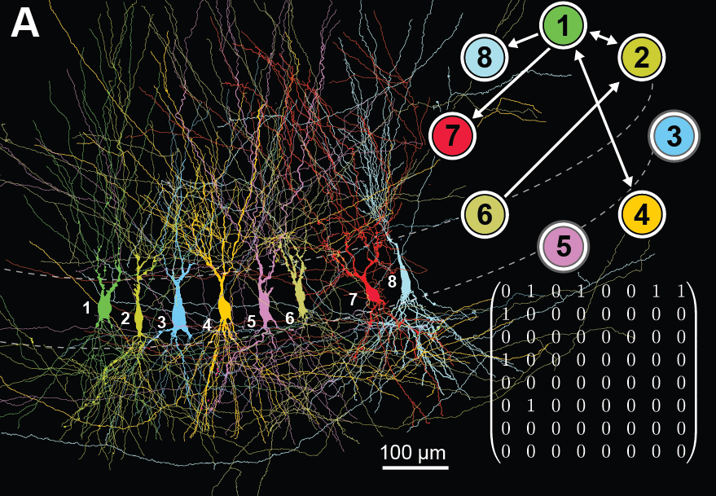

# inet 

A python module to test connectivity models based on multiple
simulatenous patch-clamp recordings between [Parvalbumin](https://en.wikipedia.org/wiki/Parvalbumin) (PV) positive [interneurons](https://en.wikipedia.org/wiki/Interneuron) and [granule cells](https://en.wikipedia.org/wiki/Granule_cell) in the [dentate gyrus](https://en.wikipedia.org/wiki/Dentate_gyrus) of mice.

It is for personal use only. 

Requirements
============

* Python (tested in 2.7 and 3.5)
* NumPy (tested in 1.13)
* Scipy (tested in 0.19)
* terminaltables (tested in 3.1.0)

How to install it
=================

`pip install git+https://github.com/ClaudiaEsp/inet.git`

Basic usage
=================
In python:

```python
from inet import DataLoader
mydataset = Dataloader('./data') # load connectivity matrices
```

Matrices of synaptic connections
================================


The folder *./data* contains the number and types of connections between
PV-positive interneurons and granule cells recorded by up to eight 
simulatenous patch-clamp recordings. Connections are represented as
nxn size matrices of pre-post connections where every element is,

* <0> if no connection, 
* <1> if chemical synapse alone, 
* <2> if electrical synapse alone and 
* <3> if both synapses together (i.e. chemical and electrical). 

A triple recording containing the connections:
* <1> chemical synapses alone: 1->2 and 2->1 
* <2> electrical synapses alone: 2->3 
* <3> both synapses: 1->3

would be represented as:

```
[ 0, 1, 3 ]
[ 1, 0, 2 ]
[ 0, 2, 0 ]
```

Note that electrical synapse will be marked two times in the matrix. The 
element (2,3) and (3,2), but it will be counted only as one synapse.

Every matrix is stored in as ASCII of the form `<filename>.syn`, where
filename is coded as `N_date_set.syn` being <N> is the number of PV-positive
interneurons. For example, a file called *1_160324_01.syn* contains
synaptic connections where the first row is a PV-positive interneuron.

Matrices of synaptic distances
==============================
The inter-somatic distances between connections are stored as in *.syn* files,but with an extension *.dist*. For example, a file called *1_160341_01.dist* is given, that could contain

```
[   0.000, -53.623,  61.854 ]
[  53.623,  0.0000, 110.419 ]
[ -61.854, -110.419,  0.000 ]

```
